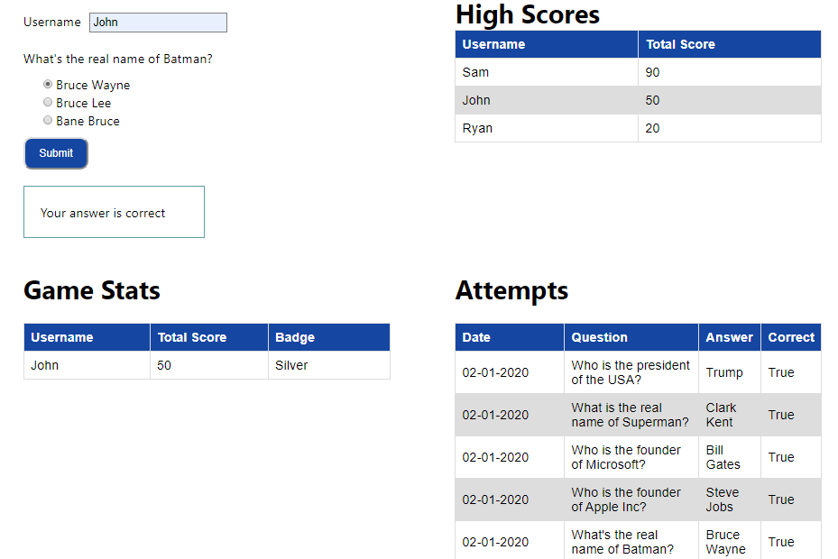

# Evaluating Micronaut Part 1

=== Software Requirements

In order to do this workshop, you need the following:

* Linux or MacOS with shell access, and the following installed:
    - `curl`.
    - `wget`.
    - `unzip`.
    - `git`.
* JDK 8.
* Docker. Please pull the following images before attending the workshop:
    - `consul`.
    - `mongo`.

=== Micronaut CLI

1. Install http://sdkman.io[SDKMAN!] if you haven't done so already.
2. Install Micronaut CLI:

    $ sdk install micronaut

3. Ensure the CLI is installed properly:

    $ mn --version
    | Micronaut Version: 1.2.6
    | JVM Version: 1.8.0_232

=== Clone this repository

Once done, you can clone this repo:

----
git clone https://github.com/linoyabut/micronaut-app.git
----

=== Application architecture

image::micronaut-arc.png[]

* `Trivia microservice` is responsible for sending the event, storing data, checking attempts and generate result. It uses hibernate as a data access layer.
* `Gamification microservice` manages all gamification busing logic and including checking the result, assign points, assign badges and updates the highest score board. It uses MongoDB for data storage.

=== Web UI

The Web UI will call Trivia API for questions data and then will call Gamification API for High Scores data.  Every user’s attempt, UI will call the Trivia API to process the user’s attempt data (please refer to the application architecture).

NOTE: For Part 1, Instead of event-driven approach for sending  any events (like user's attempt) from UI,
we call gamification API to mutate the game stat data. This is a kind of Remote Procedure Call (RPC) approach.
Also, we've used RDBMS temporarily for gamification data store.

For Part 2, we will apply the following features:
   - Event-Driven approach
   - Use MongoDB for gamification
   - Improve DB design
   - Use Kafka for Event-Driven
   - Cloud-Native features (common discovery services, distributed tracing and cloud runtimes)
   - Use Reactive programming.

